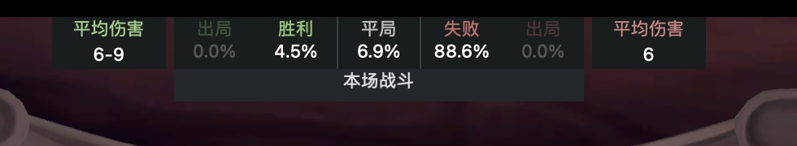

# HSTracker Companion

English | [简体中文](README.zh-CN.md)

A macOS deck tracker for Hearthstone Battlegrounds with a Chinese interface, a disabled-minions panel, Bob's Buddy, one-click disconnect ("skip"), and game tracking and HSReplay uploads that survive a reconnect. The disconnect needs no Clash, TUN or proxy. See the [integration plan](docs/hsbg-companion-integration-plan.md) for scope and acceptance criteria (in Chinese).

## Origins

This repository builds on three open-source projects:

| Project | Author | Role here |
| --- | --- | --- |
| [HSTracker](https://github.com/HearthSim/HSTracker) | HearthSim | The tracker itself. Currently based on 3.6.13. |
| [HSTracker_CHS](https://github.com/alamo68/HSTracker_CHS) | alamo68 | Direct parent. This repository keeps its git history: the Chinese localization, the disabled-minions panel, the Chinese Bob's Buddy panel and the merged top-left panel. |
| [hsbg-companion](https://github.com/zilinfg/hsbg-companion) | Zilin Fang | The disconnect backend. Its connection matching and pf rules were ported into the `HSBGSkip` daemon, replacing the Clash-based skip of HSTracker_CHS. |

What this repository changes on top of HSTracker_CHS is listed in [Changes from HSTracker_CHS](#changes-from-hstracker_chs).

For syncing, the `upstream` remote points to HearthSim/HSTracker and `hstracker-chs` to alamo68/HSTracker_CHS. See [docs/upstream-sync.md](docs/upstream-sync.md) (in Chinese).

## Changes from HSTracker_CHS

Everything HSTracker_CHS already had is kept. The changes below are what this repository adds or replaces.

**Disconnect without Clash**

- The Clash-based skip is replaced by `HSBGSkip`, a local LaunchDaemon that cuts the connection with a pf rule. Clash, TUN mode and proxy configuration are no longer needed.
- The target is the game server recorded in `GameNetLogger.log`, matched against Hearthstone's live connections. The skip is refused outside a game, when the log is missing, or when more than one connection matches, instead of cutting a guessed port.
- Each disconnect lasts 3 seconds, with at least 8 seconds between two, so a double press cannot kill the reconnect.
- The service is installed, checked, upgraded and uninstalled from 「拔线 → 服务设置…」 inside the app. An existing HSBG Companion service is migrated, and restored if the new service fails its checks.

**Tracking that survives a reconnect**

- Power.log is archived per game together with the read position, so tracking resumes after a reconnect or an app restart instead of losing the game.
- Battlegrounds history keeps games that are missing a hero or placement, marked unknown or incomplete, instead of dropping them.

**HSReplay uploads**

- When a reconnect splits one game into several `CREATE_GAME` segments, they are stitched into a single upload. If stitching fails, the last usable segment is sent and marked partial.
- The archived log is used only for reconnected games. Other games upload as before.
- Every upload is recorded as complete, partial, rejected or pending retry, under 「拔线 → HSReplay 上传记录」. Network failures can be retried from the menu.

**Other**

- Auto-updating from upstream HSTracker is turned off, so an update cannot replace this build.
- An English README, and a guide for syncing with both upstreams.

## Features

- The merged top-left panel in a game offers a one-click disconnect (「一键拔线」) and shows the banned tribes. The 「拔线」 (Skip) menu, the Dock menu and `⌘⇧K` do the same.
- A disconnect only happens when the game server recorded in `GameNetLogger.log` matches exactly one live connection of the Hearthstone process. Outside a game, with the log missing, or when the match is ambiguous, it is refused. Each disconnect lasts 3 seconds, with at least 8 seconds between two.
- After a reconnect, live tracking resumes from the current log and HearthMirror. The raw Power log and the read position are kept on disk so tracking can continue after a restart. Events the client never wrote are not made up.
- Game history keeps Battlegrounds games that lack a hero or placement, marked as unknown or incomplete. HSReplay upload results are listed under 「拔线 → HSReplay 上传记录」 (Skip → HSReplay uploads), and network failures can be retried from the menu.

## Screenshots




## Installing the disconnect service

Requires macOS 14 or later. Put the built `HSTracker.app` in Applications, open 「拔线 → 服务设置…」 (Skip → Service settings…), choose 「安装服务」 (Install service) and confirm in the macOS administrator prompt. The app bundle carries a standalone universal (Intel and Apple Silicon) LaunchDaemon. The same window can check, upgrade or uninstall it.

If the older HSBG Companion service is installed, the installer offers to migrate: it restores and stops the old service, then installs the new one, and puts the old one back if the new one fails its launch and port checks. The Companion menu bar app is no longer needed afterwards. Uninstalling removes the service's own pf rules.

In a game, click 「一键拔线」 in the top-left panel, or use the menu, the Dock menu or `⌘⇧K`. The service only acts on Hearthstone game connections. If no single target is found, 「拔线 → 检测拔线服务」 (Skip → Check service) reports the state, and 「立即恢复连接」 (Reconnect now) restores the connection.

The checklist for a first real game after installing is in [the acceptance record](docs/hsbg-integration-acceptance.md) (in Chinese).

## Game and upload records

The app keeps `PowerLogArchive`, `BgsLastGames.json` and `ReplayUploadResults.json` in `~/Library/Application Support/HSTracker`. After a reconnect or restart it only tracks state that can still be read from the logs and the game.

HSReplay uploads are built from the raw log. When a game has several `CREATE_GAME` blocks, the segments are stitched into one upload. If stitching fails, the last usable segment is sent and marked partial. Logs missing their start or required metadata are not sent. Each upload is recorded as complete, partial, rejected or pending retry. Whether HSReplay accepts an incomplete log is up to its server.

## Building from source

Requires macOS 14 or later, Xcode, and working Swift Package Manager dependencies:

```bash
xcodebuild -project HSTracker.xcodeproj -scheme HSTracker -configuration Release CODE_SIGNING_ALLOWED=NO build
```

HSTracker 3.6.13 needs HearthMirror `1a6012b5`, which HearthSim has not published on libs.hearthsim.net yet. This repository pins `912e88ea` instead, and `HSTracker/HearthMirror/MinionPoolCompat.swift` turns off reading the tavern minion pool from the game, so the minion browser falls back to the built-in database. The comment at the top of that file explains how to switch back once the new version is available.

The build compiles `hsbgskipd` for arm64 and x86_64 and puts the universal binary into the app's resources. To install locally, run `Tools/package-local.sh <path to Release/HSTracker.app>`, which ad-hoc signs and verifies the whole bundle and zips it. An unsigned `CODE_SIGNING_ALLOWED=NO` build does not give macOS a stable identity for permissions. Ad-hoc signing keeps one build's identity stable on this Mac, but a new build may need to be authorized again. Developer ID signing and notarization are out of scope. Auto-updating from upstream HSTracker is turned off so it cannot replace this build.

## License and credits

Licensed under the [LICENSE](LICENSE) at the repository root (HSTracker's MIT license). The disconnect backend keeps HSBG Companion's [MIT notice](HSBGSkip/LICENSE); its approach was first inspired by [hearthstone_skipper](https://github.com/z2z63/hearthstone_skipper). Thanks to the authors of HearthSim/HSTracker, alamo68/HSTracker_CHS and zilinfg/hsbg-companion, and to the LINUX DO community for contributions and feedback.
